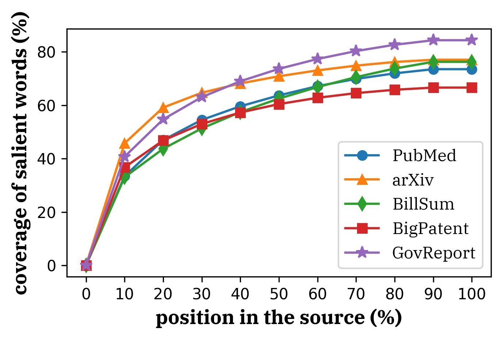

Government report dataset consists of reports written by government research agencies including [Congressional Research Service](https://crsreports.congress.gov/) and [U.S. Government Accountability Office](https://www.gao.gov/).

Compared with other long document summarization datasets, government report dataset requires reading in more context to cover salient words to be summarized. 

