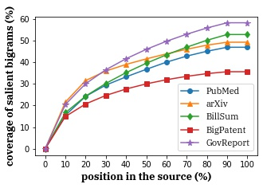
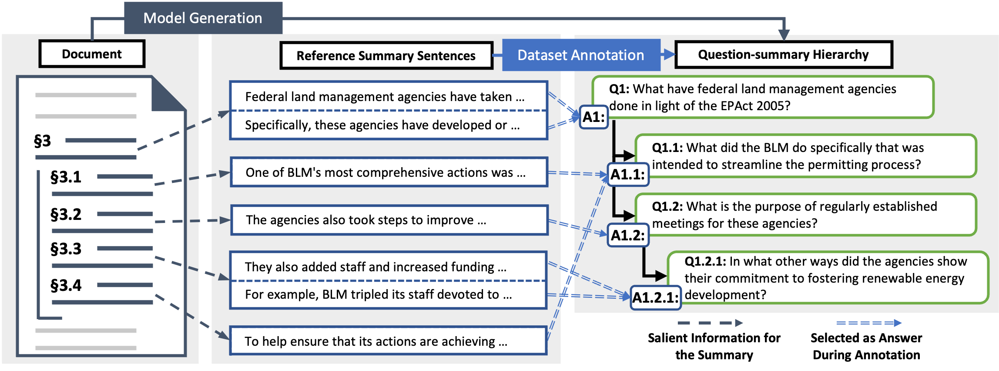

# GovReport

Government report dataset consists of reports written by government research agencies including [Congressional Research Service](https://crsreports.congress.gov/) and [U.S. Government Accountability Office](https://www.gao.gov/).

Compared with other long document summarization datasets, government report dataset has longer summaries and documents and requires reading in more context to cover salient words to be summarized. 



## Question-summary Hierarchies

We additionally collect question-summary hierarchies for government reports. This hierarchy proactively highlights the document structure, to further promote content engagement and comprehension.



------

**Citation**

GovReport

```
@inproceedings{huang-etal-2021-efficient,
    title = "Efficient Attentions for Long Document Summarization",
    author = "Huang, Luyang  and
      Cao, Shuyang  and
      Parulian, Nikolaus  and
      Ji, Heng  and
      Wang, Lu",
    booktitle = "Proceedings of the 2021 Conference of the North American Chapter of the Association for Computational Linguistics: Human Language Technologies",
    month = jun,
    year = "2021",
    address = "Online",
    publisher = "Association for Computational Linguistics",
    url = "https://aclanthology.org/2021.naacl-main.112",
    doi = "10.18653/v1/2021.naacl-main.112",
    pages = "1419--1436",
    abstract = "The quadratic computational and memory complexities of large Transformers have limited their scalability for long document summarization. In this paper, we propose Hepos, a novel efficient encoder-decoder attention with head-wise positional strides to effectively pinpoint salient information from the source. We further conduct a systematic study of existing efficient self-attentions. Combined with Hepos, we are able to process ten times more tokens than existing models that use full attentions. For evaluation, we present a new dataset, GovReport, with significantly longer documents and summaries. Results show that our models produce significantly higher ROUGE scores than competitive comparisons, including new state-of-the-art results on PubMed. Human evaluation also shows that our models generate more informative summaries with fewer unfaithful errors.",
}
```

GovReport-QS

```
@misc{cao2022hibrids,
      title={HIBRIDS: Attention with Hierarchical Biases for Structure-aware Long Document Summarization}, 
      author={Shuyang Cao and Lu Wang},
      year={2022},
      eprint={2203.10741},
      archivePrefix={arXiv},
      primaryClass={cs.CL}
}
```
